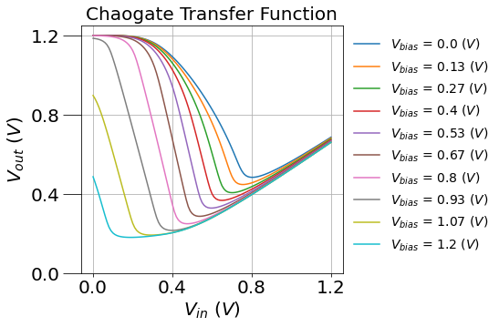
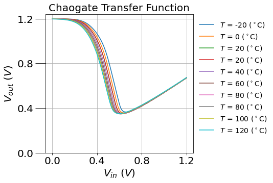
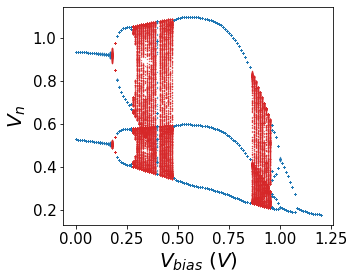
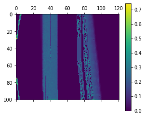
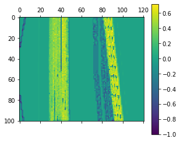

# chaogate
> Simulations of the 3-MOSFET system known as a `choagate` using `pyspice`. This library corresponds to a selection of the code used in *"Chaogate Parameter Optimization using Bayesian Optimization and Genetic Algorithm", “AI for Hardware Security", ISQED’21, 4/7/2020*.


## Install

`pip install chaogate`

## How to use

```python
import chaogate
from chaogate import *
```

Ensure you change the `global_path` to the folder containing the as described in the `core` page.

By default, they point to:

```python
global_path
```


    'C:\\Anaconda3\\Lib\\site-packages\\PySpice\\Examples\\libraries\\chaogate'


We can instantiate a chaogate with the `chaogate` function, though this is automatically called by all the other functions which need it in this library. Most functions, such as `sweep`, `grid`, and `bifurcate`, accept `kwargs` as an argument, which refers to all the possible keyword arguments of the `choagate` netlist. For exmaple,

```python
s1,s2=sweep(Vbias=(0,1.2,0.01),TEMP=(-20,120,20))
plot_sweep(s1,ncurves=10)
plot_sweep(s2,ncurves=10)
```

    sweep : Elapsed time: 0.3116 seconds
    








Once we sweep, we calculate the relevant chaotic properties using `iterate`.

This is packaged into an automatic process, along with calculating the `lyapunov` exponent, with the `bifurcate` function.

We can calculate these quantities over entire regions of parameter space with functions like `grid`, then estimate the computational stability with `boolean_divergence`:

```python
g=bifurcate(Vbias=(0,1.2,0.01),Vdd=(1.15,1.25,0.001),as_grid=True)
```

    grid : Elapsed time: 29.5447 seconds
    iterate_map : Elapsed time: 5.9907 seconds
    

```python
plot_bifurcate(itr=g.iterate.sel(Vdd=1.2),lya=g.lyapunov.sel(Vdd=1.2))
```





```python
grad = boolean_gradient(g.iterate)
div = boolean_divergence(grad)
plt.matshow(div)
plt.colorbar()
```


    <matplotlib.colorbar.Colorbar at 0x255f89bae88>





We can quickly compare the difference between the desired chaotic properties (positive $\lambda$), and the undesirable properties (the boolean divergence) by taking a linear combination such as:

```python
normalized_lyapunov = (g.lyapunov.data>0)*g.lyapunov.data/np.max(g.lyapunov.data)
normalized_divergence = div/np.max(div) 
optimizer = normalized_lyapunov - normalized_divergence 
plt.matshow(optimizer)
plt.colorbar()
```


    <matplotlib.colorbar.Colorbar at 0x255f4b6be48>





With an appropriate optimizatier we can then begin to assess the appropriate chaogate design

```python
sidis.refresh()
```
